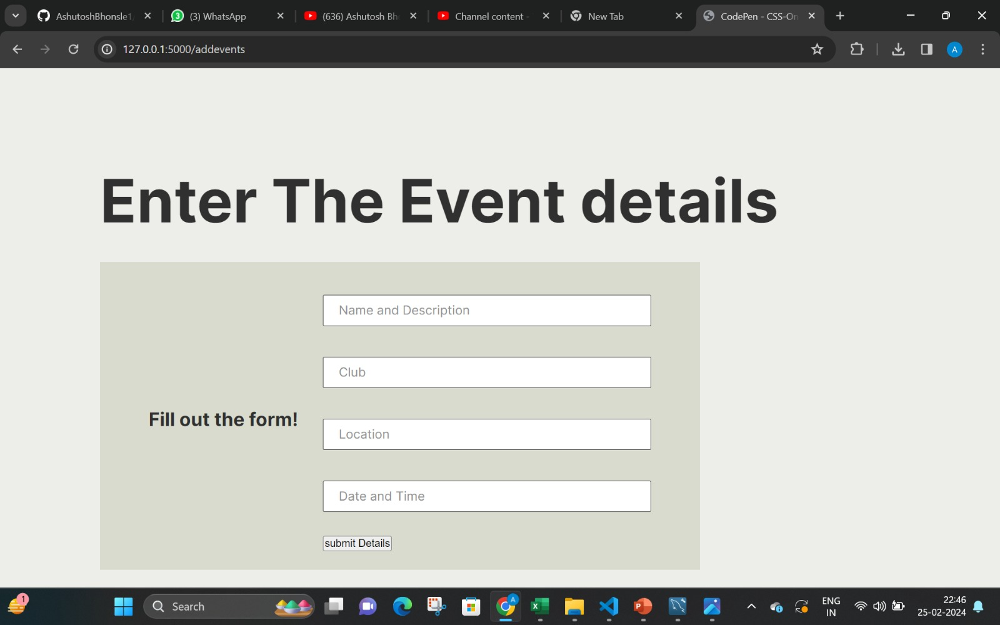
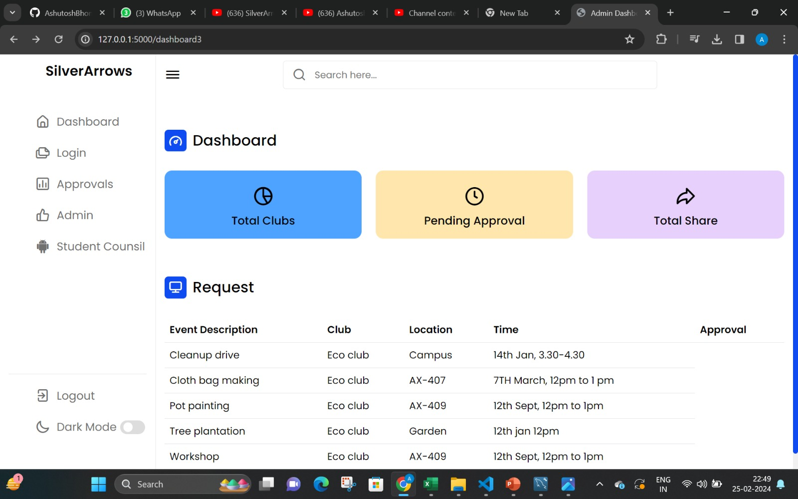
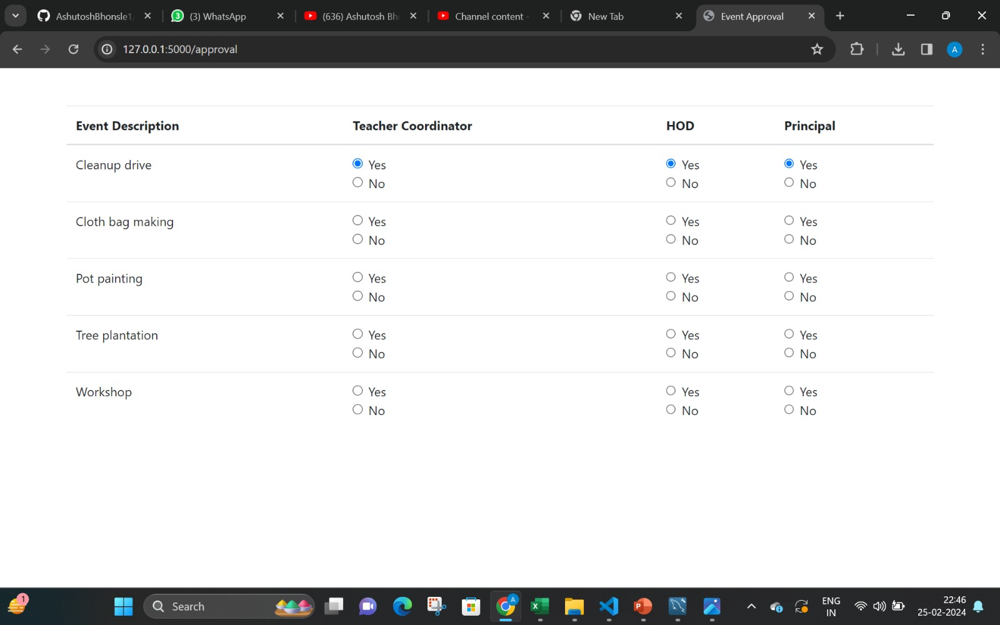

# SilverArrows
<table>
<tr>
<td>The Aim of this project is to give a smooth,synchronized way to orgranise various Events conducted by respective Clubs and to take approval from the Teacher coordinators,HODs and the principal.The students can also view the details of the events approved by the following admins.

</td>
</tr>
</table>

## Youtube
Here is the Link For the YT Video Uploaded :  https://youtu.be/QrdQnAZcAD0

## Site

### Landing page

### Event Additon

### Dashboard

### Approval page

## [Description]
This is a website that acts as a portal for the various college clubs to manage their events and get approval for it. It has a single login page for the three different roles- staff, student and clubs. On the student dashboard the students can see upcoming events. On clubs dashboard the  clubs can add new events. On staff dashboard the staff can approve or decline the request for events. All the pages are made using html, CSS JS and Ajax. The backend is made in python using Flask. MySQL is used as the database for this project.

## Built with
- [Python](https://www.python.org/)-Backend
- [Bootstrap](http://getbootstrap.com/) - Extensive list of components and  Bundled Javascript plugins.
- [flask](https://flask.palletsprojects.com/)-To connect frontend and backend
- [HTML][CSS][JAVASCRIPT]
- [AJAX]
  

## Team
*Ashutosh Bhonsle* 
*Arrpita M Abbey* 
*Christopher Aseer* 
*Benzil Saju* 
