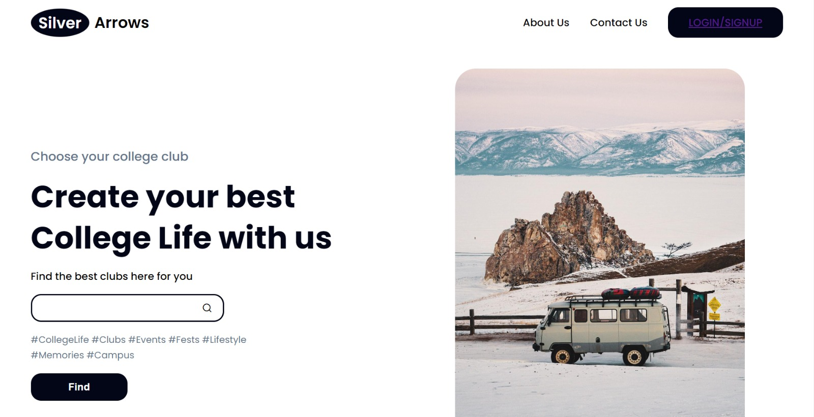

# SilverArrows
<table>
<tr>
<td>The Aim of this project is to give smooth,synchronized way to orgranise various Events conducted by respective Clubs and to take approval from the Teacher coordinators,HODs and the principal.The students can also view the details of the events approved by the following admins.

</td>
</tr>
</table>

## Youtube
Here is the Link For the YT Video Uploaded :  https://youtu.be/QrdQnAZcAD0

## Site

### Landing page

## [Usage]

### Development
Want to contribute? Great!

To fix a bug or enhance an existing module, follow these steps:

- Fork the repo
- Create a new branch (`git checkout -b improve-feature`)
- Make the appropriate changes in the files
- Add changes to reflect the changes made
- Commit your changes (`git commit -am 'Improve feature'`)
- Push to the branch (`git push origin improve-feature`)
- Create a Pull Request 

### Bug / Feature Request

If you find a bug (the website couldn't handle the query and / or gave undesired results), kindly open an issue [here](https://github.com/iharsh234/WebApp/issues/new) by including your search query and the expected result.

If you'd like to request a new function, feel free to do so by opening an issue [here](https://github.com/iharsh234/WebApp/issues/new). Please include sample queries and their corresponding results.

## Built with 

- [Python](https://www.python.org/) - .
- [Google Chart API](https://developers.google.com/chart/interactive/docs/quick_start) - Free , Rich Gallery , Customizable and Cross-browser compatible.
- [Bootstrap](http://getbootstrap.com/) - Extensive list of components and  Bundled Javascript plugins.

## To-do

## Team

## [License](https://github.com/iharsh234/WebApp/blob/master/LICENSE.md)

